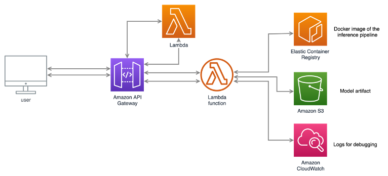

### Deploying a model to AWS Lambda

The main goal is to allow for deployment in cases where the memory size restriction would be a problem. Hence, we can execute the lambda function in a containerized runtime, where all the dependencies are correctly set according to a Docker Image saved on AWS ECR.

Finally, the model artifact is loaded from a bucket on AWS S3 and the prediction probability is returned. In order to trigger the function, Amazon API Gateway was chosen to expose the model with an API endpoint, which is protected by an API secret key.

The image below shows the built architecture:

  

One important think to keep in mind is that an IAM Role that allows the Lambda Function to read the objects stored in the S3 bucket must be created. In order to accomplish this requirement, the following steps need to be followed:

- Access AWS Console and go to `Identity and Access Management (IAM)`;  
- Go to the `Roles` sub-section and then click on `Create role`;  
- Attach these 3 policies:  
    - `AWSXRayDaemonWriteAccess`;  
    - `AWSLambdaBasicExecutionRole`;  
    - `Read-S3-Lambda`.  
- For this last custom policy, the JSON must be editted so that `Resource` is filled out by the ARN address of the S3 bucket where the model artifact is currtently stored;  

```json
{
    "Version": "2012-10-17",
    "Statement": [
        {
            "Sid": "ExampleStmt",
            "Action": [
                "s3:GetObject"
            ],
            "Effect": "Allow",
            "Resource": [
                "ARN_S3_BUCKET"
            ]
        }
    ]
}
```

- You should remember to add this role when the AWS Lambda is created from AWS ECR.
